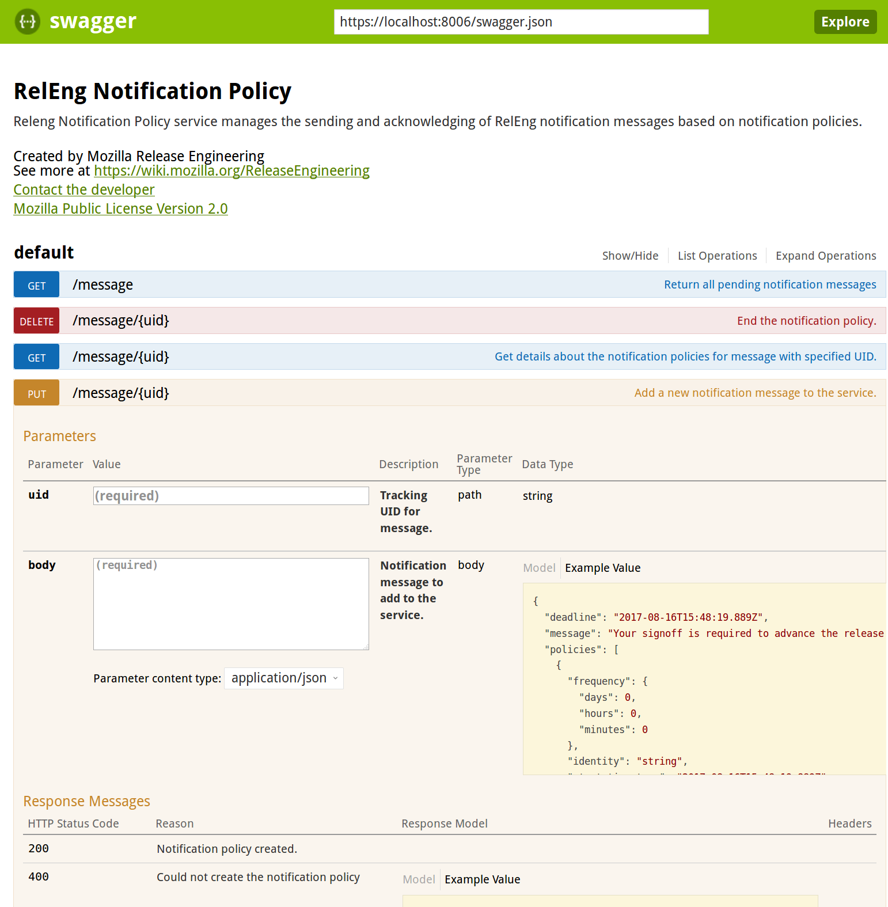

## Big Project, Small Services

<br>

#### Connor Sheehan
#### github.com/cgsheeh
#### csheehan@mozilla.com
#### IRC: sheehan

---

### Topics

- RelEng Services
- Ship-It v2
- My work
- Wrap-Up and Thanks

---

### RelEng Services

- Move all RelEng services to one repo              |
- Define all APIs with Swagger/OpenAPI              |
- Provide a single front-end (a la TaskCluster)     |
- Build all services with Nix/Docker                |

+++

### Why One Repository?

- Service discoverability                                   |
- Re-use common components (CLI tools, Flask plugins etc)   |
- Quick overview of how/where/what is running               |

+++

### Why Swagger/OpenAPI?


- Use Connexion library                                     |
- Auto-generate SwaggerUI                                   |
- Client library generation                                 |
- API specifications in YAML                                |

+++

```yaml
swagger: "2.0"
info:
  version: "1.0.0"
  title: "RelEng Notification Policy"
  description: |
    Releng Notification Policy service manages the 
    sending and acknowledging of RelEng notification
    messages based on notification policies.
  contact:
    name: Mozilla Release Engineering
    url: 'https://wiki.mozilla.org/ReleaseEngineering'
    email: release@mozilla.com
  license:
    name: Mozilla Public License Version 2.0
    url: 'https://www.mozilla.org/en-US/MPL/2.0/'

consumes:
  - application/json
produces:
  - application/json

paths:
  '/message/{uid}':
      put:
          summary: Add a new notification message to the service.
          operationId: "releng_notification_policy.api.put_message"
          parameters:
            - name: uid
              in: path
              type: string
              description: Tracking UID for message.
              required: true
    
            - name: body
              in: body
              required: true
              description: Notification message to add to the service.
              schema:
                $ref: '#/definitions/Message'
    
          responses:
            200:
              description: Notification policy created.
            409:
              description: Message or policy with the specified UID already exists
              schema:
                $ref: '#/definitions/Problem'
            400:
              description: Could not create the notification policy
              schema:
                $ref: '#/definitions/Problem'
```

@[1-19](Specify app metadata)
@[21-25](Define your URL endpoints and bind to Python views)
@[26-38](Define your required input parameters)
@[40-50](Define response codes, their format and context)

+++



---

### Ship-It v2


- Re-design of Ship-It v1
- Internal tool used across RelEng, RelMan, QE, etc
- Co-ordinate releases
- Monitor automation handoffs


+++

### Manual Sign-offs

- Model release as a "pipeline"
- Output of one pipeline is input of another
- Humans sign-off on each completed step - can cause delays

+++

### Escalating Notifications

- Two micro-services ("NagBot")
    - Identity: stores notification preferences
    - Policy: stores and executes notification policies
- Pipeline requires human work, add new notification policies to service
- Send notifications according to policies

---

### Thank you!

- Mentors (Rail Aliiev, Rok Garbas)
- Managers (Chris Cooper, Chris AtLee)
- Release Engineering Team
- Toronto office folk
- Awesome Interns!
